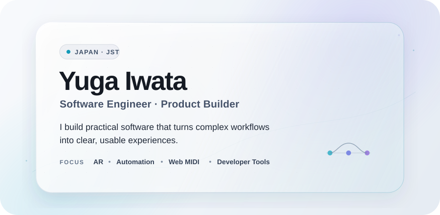
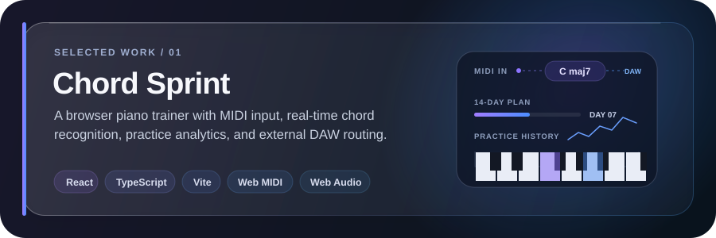
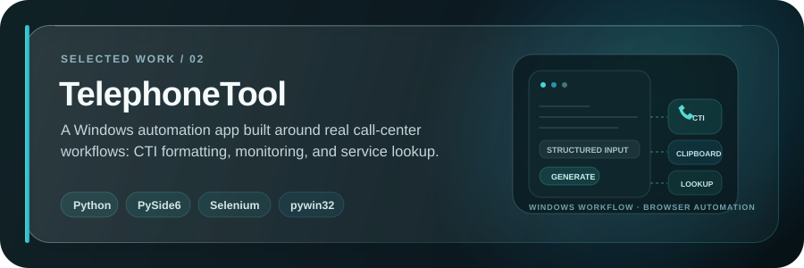

<picture>
  <source media="(prefers-color-scheme: dark)" srcset="./assets/profile/hero-dark.svg">
  <source media="(prefers-color-scheme: light)" srcset="./assets/profile/hero-light.svg">
  
</picture>

# Yuga Iwata

**Software Engineer · Product Builder**

I build practical software that turns complex workflows into clear, usable experiences.

`AR` · `Automation` · `Web MIDI` · `Developer Tools`

## About

I'm a software engineer based in Japan, focused on building tools that make complicated workflows easier to understand and operate. My work spans workflow automation, interactive web applications, AR and software visualization, and developer-focused experiments.

## Selected Work

**Chord Sprint** — A browser-based piano chord trainer with MIDI input, real-time chord recognition, practice analytics, and external DAW routing. Its song-practice mode transcribes U-FRET chord sequences and synchronizes them to YouTube using U-FRET Video Plus beat maps or Songle timing, while live MIDI feedback shows whether the voicing is correct. It also includes a structured 14-day plan, practice history, a virtual keyboard, and MIDI output for tools such as Studio One.

`React` `TypeScript` `Vite` `Web MIDI` `Web Audio` `FastAPI` `Python`

[Live Demo](https://lizqxel.github.io/PianoPractice/) · [Repository](https://github.com/Lizqxel/PianoPractice)

 

**TelephoneTool** — A Windows automation app built to streamline real call-center workflows, including CTI formatting, clipboard monitoring, and service-area lookup. It reduces repetitive customer-information entry through structured forms, generated formats, and Selenium-powered web operations without exposing customer or company data.

`Python` `PySide6` `Selenium` `pywin32`

[Repository](https://github.com/Lizqxel/TelephoneTool)

 

**ChainHardcore** — A Paper plugin that connects Minecraft players with dynamic chain physics and cooperative hardcore-style rules. It works entirely server-side with vanilla clients, and includes tension and pulling behavior, line/ring/leader/random modes, and a solo test mode.

`Java 21` `Paper` `Gradle` `Minecraft 1.21.x`

[Repository](https://github.com/Lizqxel/Minecraft-ChainHardcore-Plugin)

## Toolbox

**Languages** 
`TypeScript` `Python` `Java` `C`

**Frontend & Interactive** 
`React` `Vite` `Web MIDI` `Web Audio` `Unity`

**Backend & Automation** 
`FastAPI` `PySide6` `Selenium` `Docker`

**Tools** 
`Git` `GitHub` `VS Code` `Notion` `Figma`

## Current Focus

- AR × software visualization
- Practical workflow automation
- Interfaces that make complex systems easier to understand

---

*Building useful things, one experiment at a time.*
