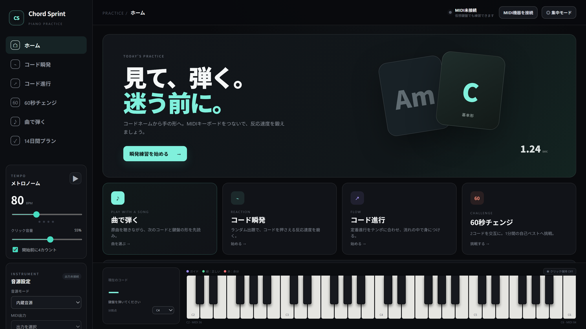
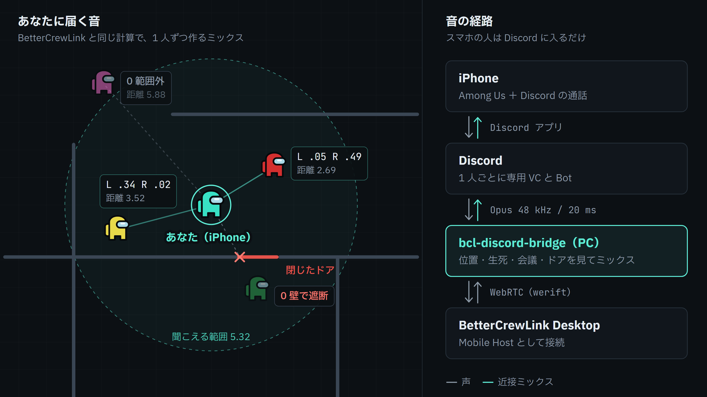
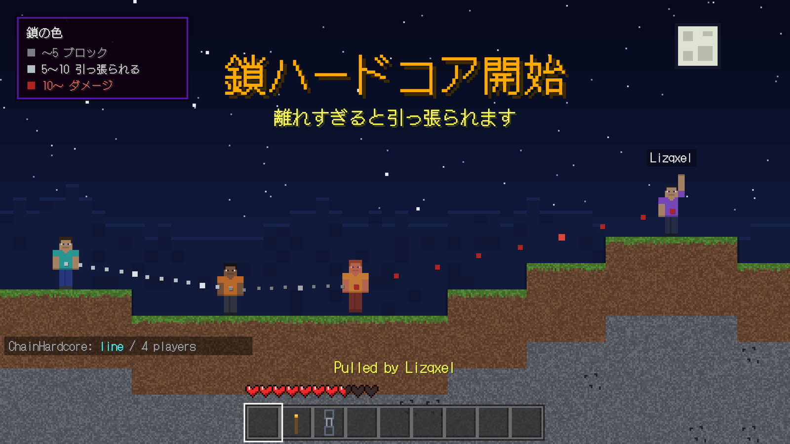

公立はこだて未来大学の学生です。研究では AR を使ったソフトウェアの可視化に取り組んでいます。

研究のほかに作っているものは、だいたい身のまわりの「ここが面倒」から始まっています。コールセンターの仕事で毎回くり返す入力作業、ピアノのコード練習、スマホ 1 台だと近接ボイスに入れない Among Us。下に並べたのはそういうものです。

## 作ったもの

### [Chord Sprint](https://github.com/Lizqxel/PianoPractice)

コードネームを見てから鍵盤を押さえるまでを速くするための、MIDI キーボード対応の練習アプリです。ランダム出題、定番進行、60 秒チャレンジ、14 日間プランなどのモードがあります。

目玉は「曲で弾く」です。U-FRET のコード譜を取り込んで YouTube の原曲と同期させ、いま・次・その次のコードと押さえ方を表示します。同期には U-FRET 動画プラスの拍情報か Songle の解析結果を使い、どちらでも合わせきれないときは、ずれた譜面を出さずに止めるようにしました。[公開版](https://lizqxel.github.io/PianoPractice/)では「常夜燈 / PEOPLE1」で同期を試せます。

React / TypeScript / Web MIDI / Web Audio / FastAPI

### [BCL Discord Bridge](https://github.com/Lizqxel/bcl-discord-bridge)

iPhone 1 台で Among Us をやると、ゲームに切り替えた瞬間に Safari のマイクが止まって、BetterCrewLink の近接ボイスチャットが使えません。そこでスマホの人には Discord の通話に入ってもらうだけにして、PC 側で 1 人ずつ専用の近接ミックスを作り、Discord 越しに返す中継アプリを作りました。

聞こえ方は BetterCrewLink Desktop の音響処理を移植しています。距離による減衰と左右の定位、壁やドアでの遮断、ベントの中のこもった声、インポスター無線まで再現していて、減衰と定位は Web Audio の PannerNode と数値が一致することをテストで確かめています。Discord では Bot 1 体が同時に入れるボイスチャンネルが 1 つだけなので、スマホの人数ぶん Bot を立てる構成です。

TypeScript / Node.js / discord.js / werift

### [TelephoneTool](https://github.com/Lizqxel/TelephoneTool)

コールセンター業務用の Windows アプリです。顧客情報をフォームに入れると CTI に貼るフォーマットを組み立て、住所から NTT 西日本の光回線の提供エリアを調べて結果まで書き込みます。1 件ごとに手でやっていたコピペとサイト検索を、ボタン 1 つにまとめました。

住所リストを CSV で一括判定する [CTI-Precheck](https://github.com/Lizqxel/CTI-Precheck) もあります。

Python / PySide6 / Selenium / pywin32

### [ChainHardcore](https://github.com/Lizqxel/Minecraft-ChainHardcore-Plugin)

プレイヤー同士を鎖でつなぐ Minecraft（Paper 1.21）のプラグインです。Chained Together のような遊びを、MOD もリソースパックも入れていないクライアントのまま遊べるようにしました。鎖はパーティクルで描き、離れると引き寄せられ、伸びきるとダメージ。誰か 1 人でも死んだら全員ゲームオーバーです。1 人で動作確認できるように、歩き回る村人を相手にするテストモードも入れています。

Java 21 / Paper / Gradle

## ほかにも

- [InteractiveSystem](https://github.com/Lizqxel/InteractiveSystem)：授業で作った Unity の駐車練習ゲーム。運転席からの視点とサイドミラーを再現していて、M キーで視界が揺れる「酔っ払いモード」になります。
- [キンダーフォト](https://github.com/Lizqxel/iDeaHackathon_mock_photo)：ハッカソンで作った、保育園で撮った写真を顔認識で自動分類するアプリの試作。オフラインで動きます。
- [callcenter-rag_poc](https://github.com/Lizqxel/callcenter-rag_poc)：研修動画を文字起こしして、質問すると該当箇所をタイムコードつきで返す RAG の PoC。外部 API を使わずローカルで完結します。
- [Step&](https://github.com/Lizqxel/stepand_mockup)：散歩に AR のストーリーを重ねるアプリのモックアップ。
- [multisoup-extensions](https://github.com/Lizqxel/multisoup-extensions)：地図サイトに住所検索バーを後付けする Tampermonkey スクリプト。
